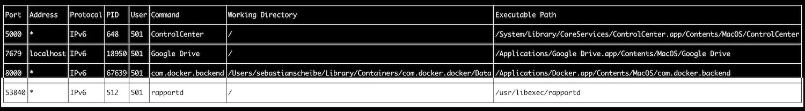

# Port Report

Port Report is a Go-based terminal application that displays listening processes along with their details such as PID, command, user, address, port, executable path, and working directory. It also provides functionality to kill these processes directly from the UI.

## Features

- **Display Listening Processes**: Lists all listening network services running on your system.
- **Process Information**: Shows detailed information about each process including PID, command, user, protocol, IP address, port number, executable path, and working directory.
- **Kill Process**: Provides an interactive button to kill the selected process.

## Limitations
- **Killing Processes**: Killing a process with kill -9 is a forceful action. Use with caution.
- **macOS only**: This application is designed specifically for macOS.

## Installation

### Prerequisites
- Ensure you have Go installed on your system. You can download it from [here](https://golang.org/dl/).

### Steps to Install

```sh
git clone https://github.com/Ecostack/port-report.git
cd port-report
go install
```

## Screenshots




